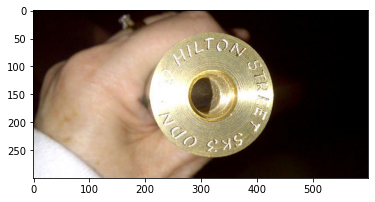
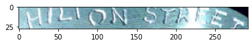
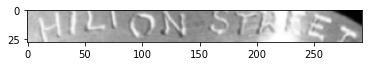
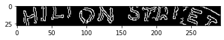
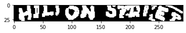

# Craft Text Detector
craft-text-detector 0.3.1


```python
# import Craft class
from craft_text_detector import Craft
import matplotlib.pyplot as plt
import matplotlib.image as mpimg 
```


```python
# set path to image and export folder directory
image_path = './Web Images/C-1.jpg'
output_dir = './Web Images/Craft Output/'
image = mpimg.imread(image_path)
plt.imshow(image)
```


    <matplotlib.image.AxesImage at 0x7fa83208a700>


    

    


```python
# create a craft instance
craft = Craft(output_dir=output_dir, crop_type="poly", cuda=False)
```


```python
# apply craft text detection and export detected regions to output directory
prediction_result = craft.detect_text(image_path)
```


```python
# unload models from ram/gpu
craft.unload_craftnet_model()
craft.unload_refinenet_model()
```


```python
import pytesseract
```


```python
# The text regions can be found in _crops folder.  Using one of the image.
crop_image_path = output_dir + '/C-1_crops/crop_0.png'
crop_image = mpimg.imread(crop_image_path)
plt.imshow(crop_image)
# print(pytesseract.image_to_string(Image.open(crop_image)))
print(pytesseract.image_to_string(crop_image_path))
print(crop_image.shape)
```

     
    
    ELON mega | a
    
    (28, 292, 3)


    

    


## Pass the image through edge detection and dilation to see if we can get better result from tesseract


```python
import cv2
import numpy as np
```


```python
cv2_gray = cv2.imread(crop_image_path)
gray = cv2.cvtColor(cv2_gray, cv2.COLOR_BGR2GRAY)
plt.imshow(gray,'gray')
```


    <matplotlib.image.AxesImage at 0x7fa832007e20>


    

    


```python
blur = cv2.GaussianBlur(gray, (3,3), 0)
plt.imshow(blur, 'gray')
```


    <matplotlib.image.AxesImage at 0x7fa8322269d0>


    

    


```python
# perform edge detection, then perform a dilation + erosion to
# close gaps in between object edges
#grayCopy = np.uint8(gray)
# edged = cv2.Canny(gray, 180,80) note 180,80 and not 0,255.  
edged = cv2.Canny(blur,180,80)
plt.imshow(edged, 'gray')
```


    <matplotlib.image.AxesImage at 0x7fa831072490>


    

    


```python
#
print(pytesseract.image_to_string(edged))
print(crop_image.shape)
```

    tee
    ON SERENES
    rae
    
    (28, 292, 3)


```python
dilate = cv2.dilate(edged, None, iterations=1)
plt.imshow(dilate, 'gray')
```


    <matplotlib.image.AxesImage at 0x7fa83202f6d0>


    

    


```python
print(pytesseract.image_to_string(dilate))
print(crop_image.shape)
```

    Ree mee yo 8 ie oe
    
    (28, 292, 3)

